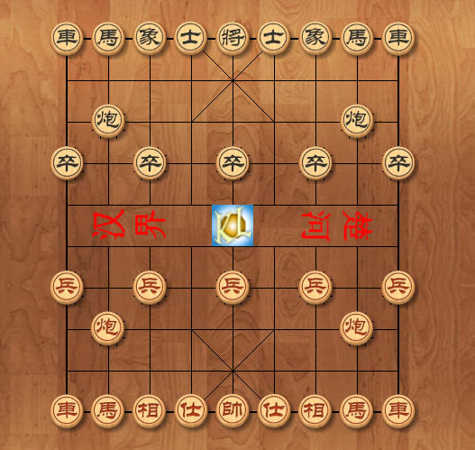
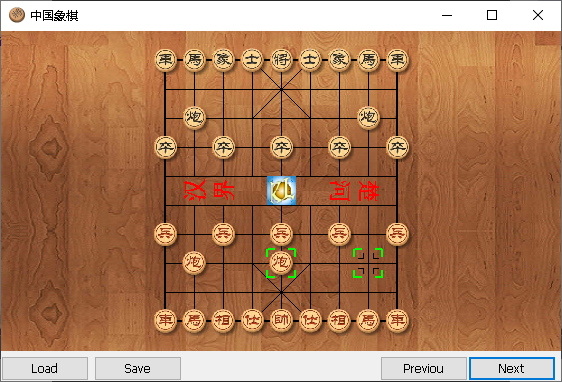
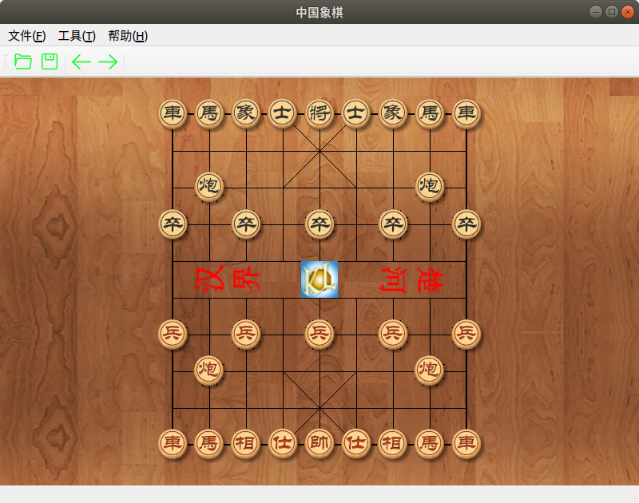
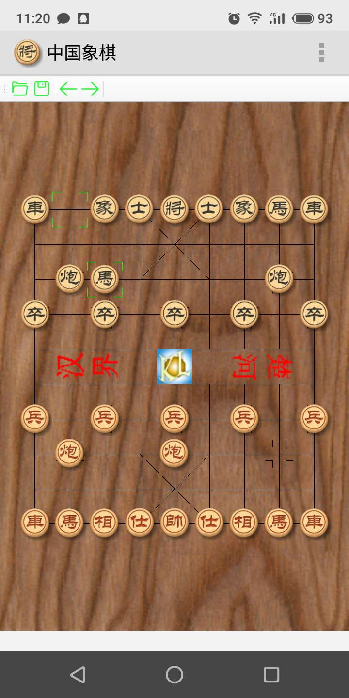

## [中国象棋控件](https://github.com/KangLin/ChineseChessControl)

作者：康林 (kl222@126.com)

------------------------

- master 分支: 
- develop 分支: 

-------------------------

- [简介](#简介)
- [屏幕截图](#屏幕截图)
- [下载安装包](#下载安装包)
- [贡献](#贡献)
  - [捐赠](#捐赠)
- [许可协议](License.md)
- [修改日志](ChangeLog.md)
- [文档](#文档)

-------------------------

#### 简介
中国象棋控件。

- 项目位置：
  + 主库: https://github.com/KangLin/ChineseChessControl
  + 镜像:
    - https://gitee.com/kl222/ChineseChessControl
    - https://sourceforge.net/projects/chinesechesscontrol/
    - https://gitlab.com/kl222/ChineseChessControl
    - https://launchpad.net/chinesechesscontrol

##### 功能
- [x] 控件
  + [x] [中国象棋库](Documents/Developer.md#中国象棋库)
    - [x] 中国象棋基本规则
    - [x] 棋局保存和复盘
  + [x] [中国象棋 MFC 扩展动态库](Documents/Developer.md#中国象棋-MFC-扩展动态库)
  + [x] [中国象棋 ActiveX 控件](ActiveX.md)
  + [x] [中国象棋 Qt 插件](Documents/Developer.md#中国象棋-Qt-插件)
- [ ] 中国象棋博弈引擎与通信协议
- [x] 中国象棋程序
  + [x] 单机版本
      + [x] MFC 版本
      + [x] Qt 版本
  + [ ] 联网版本。欢迎使用本项目库应用到你的中国象棋程序。

*图例：*

+ [x] 表示已完成的功能
+ [ ] 表示尚未完成的功能

- 支持平台：
  + [x] Windows
  + [x] Linux
  + [x] Android
  + [x] mac、IOS 本人无此设备，请你自行编译、测试

#### 屏幕截图

#### [下载安装包](https://github.com/KangLin/ChineseChessControl/releases/latest)
+ [最后版本](https://github.com/KangLin/ChineseChessControl/releases/latest)
+ 当前版本：
  - Windows安装包，支持 Windows 7 以上系统。
    - ChineseChessControl_v2.0.10_msvc1929_x86_64_Setup.exe
      - [从 GITHUB 下载](https://github.com/KangLin/ChineseChessControl/releases/download/v2.0.10/ChineseChessControl_v2.0.10_msvc1929_x86_64_Setup.exe)
      - [从 Sourceforge 下载](https://sourceforge.net/projects/chinesechesscontrol/files/v2.0.10/ChineseChessControl_v2.0.10_msvc1929_x86_64_Setup.exe/download)
    - ChineseChessControl_v2.0.10_msvc1916_x86_Setup.exe
      - [从 GITHUB 下载](https://github.com/KangLin/ChineseChessControl/releases/download/v2.0.10/ChineseChessControl_v2.0.10_msvc1916_x86_Setup.exe)
      - [从 Sourceforge 下载](https://sourceforge.net/projects/chinesechesscontrol/files/v2.0.10/ChineseChessControl_v2.0.10_msvc1916_x86_Setup.exe/download)

  - Windows开发包，安装完成后，使用请详见：[开发者文档](Documents/Developer.md#调试)

    - ChineseChessControl_v2.0.10_win32_msvc2017_Qt5.12.12_Develop.zip
      - [从 GITHUB 下载](https://github.com/KangLin/ChineseChessControl/releases/download/v2.0.10/ChineseChessControl_v2.0.10_win32_msvc2017_Qt5.12.12_Develop.zip)
      - [从 Sourceforge 下载](https://sourceforge.net/projects/chinesechesscontrol/files/v2.0.10/ChineseChessControl_v2.0.10_win32_msvc2017_Qt5.12.12_Develop.zip/download)
    - ChineseChessControl_v2.0.10_win64_msvc2019_64_qt6.5.1_Develop.zip
      - [从 GITHUB 下载](https://github.com/KangLin/ChineseChessControl/releases/download/v2.0.10/ChineseChessControl_v2.0.10_win64_msvc2019_64_qt6.5.1_Develop.zip)
      - [从 Sourceforge 下载](https://sourceforge.net/projects/chinesechesscontrol/files/v2.0.10/ChineseChessControl_v2.0.10_win64_msvc2019_64_Qt6.5.1_Develop.zip/download)

  - linux
    - chinesechesscontrol_v2.0.10_Linux_x86_64_setup.sh
      - [从 GITHUB 下载](https://github.com/KangLin/ChineseChessControl/releases/download/v2.0.10/chinesechesscontrol_v2.0.10_Linux_x86_64_setup.sh)
      - [从 Sourceforge 下载](https://sourceforge.net/projects/chinesechesscontrol/files/v2.0.10/chinesechesscontrol_v2.0.10_Linux_x86_64_setup.sh/download)

  - ubuntu
    - chinesechesscontrol_v2.0.10_Linux_x86_64_setup.deb
      - [从 GITHUB 下载](https://github.com/KangLin/ChineseChessControl/releases/download/v2.0.10/chinesechesscontrol_v2.0.10_Linux_x86_64_setup.deb)
      - [从 Sourceforge 下载](https://sourceforge.net/projects/chinesechesscontrol/files/v2.0.10/chinesechesscontrol_v2.0.10_Linux_x86_64_setup.deb/download)

  - Macos
    - chinesechesscontrol_v2.0.10_Darwin_x86_64_setup.tar.gz
      - [从 GITHUB 下载](https://github.com/KangLin/ChineseChessControl/releases/download/v2.0.10/chinesechesscontrol_v2.0.10_Darwin_x86_64_setup.tar.gz)
      - [从 Sourceforge 下载](https://sourceforge.net/projects/chinesechesscontrol/files/v2.0.10/chinesechesscontrol_v2.0.10_Darwin_x86_64_setup.tar.gz/download)

  - Android
    - APK
      - ChineseChessControl_v2.0.10_android_arm64_v8a_qt6.5.1_Release.apk
        - [从 GITHUB 下载](https://github.com/KangLin/ChineseChessControl/releases/download/v2.0.10/ChineseChessControl_v2.0.10_android_arm64_v8a_qt6.5.1_Release.apk)
        - [从 Sourceforge 下载](https://sourceforge.net/projects/chinesechesscontrol/files/v2.0.10/ChineseChessControl_v2.0.10_android_arm64_v8a_qt6.5.1_Release.apk/download)
      - ChineseChessControl_v2.0.10_android_armv7_qt6.5.1_Release.apk
        - [从 GITHUB 下载](https://github.com/KangLin/ChineseChessControl/releases/download/v2.0.10/ChineseChessControl_v2.0.10_android_armv7_qt6.5.1_Release.apk)
        - [从 Sourceforge 下载](https://sourceforge.net/projects/chinesechesscontrol/files/v2.0.10/ChineseChessControl_v2.0.10_android_armv7_qt6.5.1_Release.apk/download)
      - ChineseChessControl_v2.0.10_android_x86_64_qt6.5.1_Release.apk
        - [从 GITHUB 下载](https://github.com/KangLin/ChineseChessControl/releases/download/v2.0.10/ChineseChessControl_v2.0.10_android_x86_64_qt6.5.1_Release.apk)
        - [从 Sourceforge 下载](https://sourceforge.net/projects/chinesechesscontrol/files/v2.0.10/ChineseChessControl_v2.0.10_android_x86_64_qt6.5.1_Release.apk/download)
    - 开发包
      - ChineseChessControl_v2.0.10_android_arm64_v8a_qt6.5.1_Release.zip
        - [从 GITHUB 下载](https://github.com/KangLin/ChineseChessControl/releases/download/v2.0.10/ChineseChessControl_v2.0.10_android_arm64_v8a_qt6.5.1_Release.zip)
        - [从 Sourceforge 下载](https://sourceforge.net/projects/chinesechesscontrol/files/v2.0.10/ChineseChessControl_v2.0.10_android_arm64_v8a_qt6.5.1_Release.zip/download)
      - ChineseChessControl_v2.0.10_android_armv7_qt6.5.1_Release.zip
        - [从 GITHUB 下载](https://github.com/KangLin/ChineseChessControl/releases/download/v2.0.10/ChineseChessControl_v2.0.10_android_armv7_qt6.5.1_Release.zip)
        - [从 Sourceforge 下载](https://sourceforge.net/projects/chinesechesscontrol/files/v2.0.10/ChineseChessControl_v2.0.10_android_armv7_qt6.5.1_Release.zip/download)
      - ChineseChessControl_v2.0.10_android_x86_64_qt6.5.1_Release.zip
        - [从 GITHUB 下载](https://github.com/KangLin/ChineseChessControl/releases/download/v2.0.10/ChineseChessControl_v2.0.10_android_x86_64_qt6.5.1_Release.zip)
        - [从 Sourceforge 下载](https://sourceforge.net/projects/chinesechesscontrol/files/v2.0.10/ChineseChessControl_v2.0.10_android_x86_64_qt6.5.1_Release.zip/download)

+ 文档
  - [从 GITHUB 下载](https://github.com/KangLin/ChineseChessControl/releases/download/v2.0.10/ChineseChessControl_v2.0.10_document.zip)
  - [从 Sourceforge 下载](https://sourceforge.net/projects/chinesechesscontrol/files/v2.0.10/ChineseChessControl_v2.0.10_document.zip/download)
+ [在线文档](https://kanglin.github.io/ChineseChessControl/html/index.html)

#### 贡献
- 欢迎大家参与本项目开发，共同完成[功能](#功能)列表中未完成的功能。
  + [问题与讨论](https://github.com/KangLin/ChineseChessControl/issues)
  + [感谢贡献者](https://github.com/KangLin/ChineseChessControl/graphs/contributors)
- 使用本项目用于你的项目。

##### 捐赠
本软件如果对你有用，或者你喜欢它，请你捐赠，支持作者。谢谢！

如果不能显示，请打开：
- https://gitlab.com/kl222/RabbitCommon/-/raw/master/Src/Resource/image/Contribute.png
- https://sourceforge.net/p/rabbitcommon/code/ci/master/tree/Src/Resource/image/Contribute.png

#### [许可协议](License.md)
#### [修改日志](ChangeLog.md)
#### 文档
- [开发者文档](Documents/Developer.md)
- COM 文档
  + [COM学习笔记](Documents/COM/COM学习笔记.html)
  + [COM中的事件响应](Documents/COM/COM中的事件响应.html)
- ActiveX 控件
  + [建立ActiveX控件](Documents/ActiveX控件/建立ActiveX控件.html)
  + [VC下使用ActiveX控件的问题](Documents/ActiveX控件/VC下使用ActiveX控件的问题.html)

