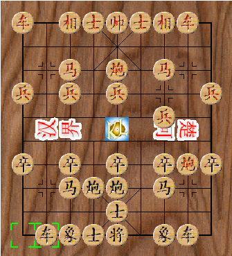

## 中国象棋控件

作者：康林(kl222@126.com)

-------------------------

- [简介](#简介)
- [屏幕截图](#屏幕截图)
- [开发](#开发)
  - [编译](#编译)
  - [调试](#调试)

-------------------------

#### 简介
中国象棋控件。

- 中国象棋 ActivX 控件

- 项目主页：https://github.com/KangLin/ChineseChessCtr

#### 捐赠
本软件如果对你有用，或者你喜欢它，请你捐赠，支持作者。谢谢！

#### 屏幕截图

#### 开发

##### 编译
- 用 cmake , 建议使用此方法

    mkdir build
	cd build
	cmake ..
	cmake --build .

- 用VC6.0打开 Src/ChineseChessCtr.dsw,直接编译
- 用 VC2017 打开 Src/ChineseChessCtr.sln ,直接编译

##### 调试
###### VC6.0
- 打开 ActiveX control test container 工具  

- 注册中国象棋控件
  这一步在编译后，会自动执行。如果没有成功，可以按下面方法注册：
  **注意**:需要管理员权限
  + 手工注册

				regsvr32 /s /c "D:\Source\ChineseChessCtr\Src\.\DebugU\ChineseChessCtr.ocx" 

  + 用 ActiveX control test container 注册
    - 打开注册控件  

    - 注册中国象棋控件  
      + 
      + 
      + 
- 插入中国象棋控件  

- 调试  

###### vc 2017

- 从 VC 2010 没有自带 ActivX control test container 工具，而是以例子程序的方式提供。所以你可以从 vc6.0 中复制过来，或者，从VC2017安装的例子程序中编译得到。

[Testing Properties and Events with Test Container](https://docs.microsoft.com/en-us/cpp/mfc/testing-properties-and-events-with-test-container)

如果没安装，则可从 github 上下载[源码](https://github.com/microsoft/VCSamples/tree/master/VC2010Samples/MFC/ole/TstCon)

- 工具->外部工具->添加
  + 
  + 
- 剩下的调试步骤与上面VC6.0的一样
