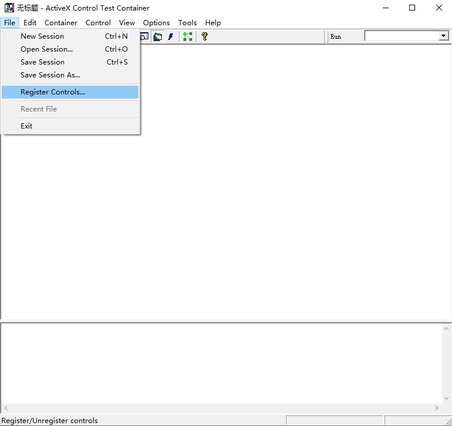
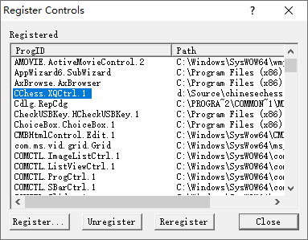
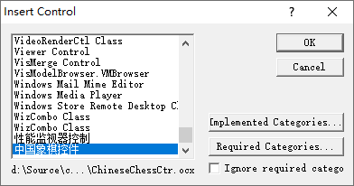
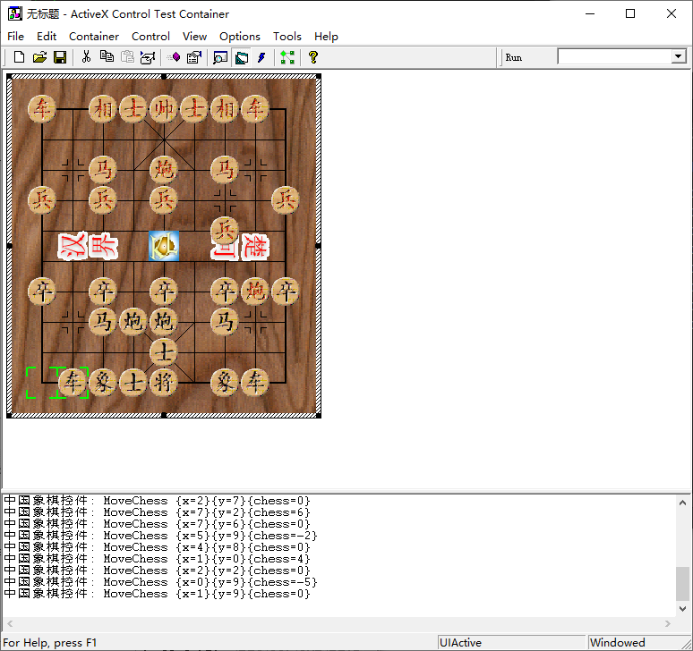

## 中国象棋控件

作者：康林(kl222@126.com)

=========================

- [简介](#简介)
- [屏幕截图](#屏幕截图)
- [开发](#开发)
  - [编译](#编译)
  - [调试](#调试)

-------------------------

#### 简介
中国象棋控件。

- 中国象棋 ActivX 控件

- 项目主页：https://github.com/KangLin/ChineseChessCtr

#### 屏幕截图

#### 开发

##### 编译

- 用VC6.0打开 Src/ChineseChessCtr.dsw,直接编译
- 用 VC2013 打开 Src/ChineseChessCtr.sln ,直接编译

##### 调试
###### VC6.0
- 打开 ActiveX control test container 工具

- 打开注册控件

- 注册中国象棋控件

- 插入中国象棋控件

- 调试

###### vc 2013

- VC 2013 没有自带 ActivX control test container 工具，而是以例子程序的方式提供。所以你可以从 vc6.0 中复制过来，或者，从VC2013安装的例子程序中编译得到。
- 工具->外部工具->添加

- 剩下的调试步骤与上面VC6.0的一样